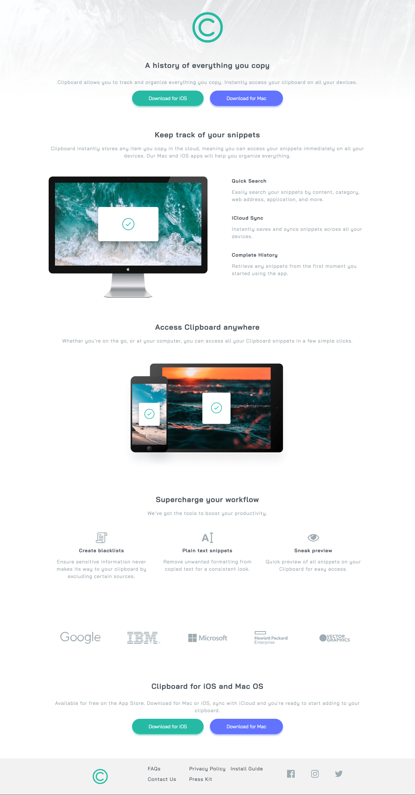
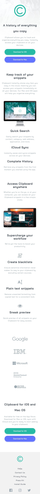

# Frontend Mentor - Clipboard landing page solution

This is a solution to the [Clipboard landing page challenge on Frontend Mentor](https://www.frontendmentor.io/challenges/clipboard-landing-page-5cc9bccd6c4c91111378ecb9). Frontend Mentor challenges help you improve your coding skills by building realistic projects.

## Table of contents

- [Overview](#overview)
  - [The challenge](#the-challenge)
  - [Screenshot](#screenshot)
  - [Links](#links)
- [My process](#my-process)
  - [Built with](#built-with)
  - [Continued development](#continued-development)
- [Author](#author)

## Overview

### The challenge

Users should be able to:

- View the optimal layout for the site depending on their device's screen size
- See hover states for all interactive elements on the page

### Screenshot

### Screenshot - Mobile

### Links

- Solution URL: [Add solution URL here](https://your-solution-url.com)
- Live Site URL: [Add live site URL here](https://your-live-site-url.com)

### Built with

- Semantic HTML5 markup
- CSS custom properties
- CSS Grid
- Mobile-first workflow
- Bottom-up approach
- [Normalize.css](https://necolas.github.io/normalize.css/) - Normalize.css

### Continued development

This was a fantastic opportunity to approach front-end development with a mobile-first and bottom-up approach - something which made the process a lot more paletable. My major roadblocks with the bottom-up approach, however, was keeping consistency between design decicions, being only able to solve them when the components were put together and I could see the differences. There are a couple quirks with the desktop design, I think the padding and margins could be altered to match the design spec. I also need to review semantic HTML again, as there is is still confusion on how and when to use the appropriate markup. However, overall, I'm pleased with the result.

## Author

- GitHub - [@valleyman89](https://github.com/valleyman89)
- Frontend Mentor - [@valleyman89](https://www.frontendmentor.io/profile/valleyman89)
- Twitter - [@steven_rolph](https://www.twitter.com/steven_rolph)
